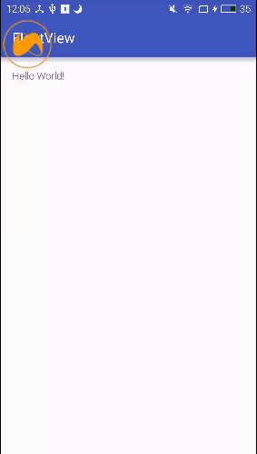

# 浮标项目

## 浮标特性
1. 触摸浮标移动特性
2. 点击浮标展开特性
3. 3s内无操作，浮标自动掩藏在两侧（由于浮标只用了一张图片，所以两侧掩藏时只是靠边了）

## 效果图


## 实现原理

### 创建浮标
1. 获取WindowManager系统服务
2. 设置浮标显示的参数WindowManager.LayoutParams
3. 获取浮标布局并添加到WindowManager里面去
4. 代码示例：
```java
mMansger = (WindowManager)context.getApplicationContext().getSystemService(Activity.WINDOW_SERVICE);
mParams = new WindowManager.LayoutParams();
screen_widht = mMansger.getDefaultDisplay().getWidth();
screen_height = mMansger.getDefaultDisplay().getHeight();

mParams.format = PixelFormat.RGBA_8888;                                                     //图片格式为透明
mParams.type = WindowManager.LayoutParams.TYPE_PHONE;                                       //处于所有应用顶端，状态栏之下
mParams.flags = WindowManager.LayoutParams.FLAG_NOT_FOCUSABLE;                              //不获取焦点
mParams.gravity = Gravity.LEFT | Gravity.TOP;                                               //左上对齐
mParams.x = float_x;
mParams.y = float_y;                                                                        //相对于上面的原点
mParams.width = LayoutParams.WRAP_CONTENT;
mParams.height = LayoutParams.WRAP_CONTENT;

mFloatLayout = (LinearLayout)LayoutInflater.from(context).inflate(R.layout.float_window, null);
mMansger.addView(mFloatLayout, mParams);
```


### 触摸移动
设置浮标移动监听OnTuchListener,监听工作：
1. 获取当前触摸位置，并将此位置更新至布局updateViewLayout
2. 代码示例：	
```java
floatImage.setOnTouchListener(new View.OnTouchListener() {
	@Override
	public boolean onTouch(View v, MotionEvent event) {
		isMove = true;
		if(event.getAction() == MotionEvent.ACTION_DOWN){

			return false;
		}

		//滑动操作
		if(mFloatLayout != null){
			float_x = (int)event.getRawX();
			float_y = (int)event.getRawY();
			int width = mFloatLayout.getWidth();
			int height = mFloatLayout.getHeight();
			if(float_x + width > screen_widht){
				float_x = screen_height - width;
			}

			if(float_y + height > screen_height){
				float_y = screen_height - height;
			}

			//作画默认是从view的左上角画，导致在移动过程中摸不着view  所以要向上和左位置前移就能摸到了
			mParams.x = (float_x - width/2) > 0 ? float_x - width/2 : 0;
			mParams.y = (float_y - height/2) > 0 ? float_y - height/2 : 0;
			mMansger.updateViewLayout(mFloatLayout, mParams);
		}

		/**
		 * 抬起默认滑动结束
		 */
		if(event.getAction() == MotionEvent.ACTION_UP){
			isMove = false;
			task_restore.postDelayed(retoreFloatView, 3000);                                //3s内无操作进行隐藏工作
		}

		return false;
	}
});
```

### 点击监听
1. 点击就是setOnclickListener，这个很简单就不进行说明了

### 自动掩藏
1. 原理：
   利用Handler延时操作执行浮标掩藏工作，其原理就是在滑动时抬起动作和点击事件后，执行掩藏，刷新的最后一步判断浮标是否还有操作，有操作就不掩藏了，反之则掩藏
2. 代码示例：

```java
 private Runnable retoreFloatView = new Runnable() {
	@Override
	public void run() {

		account_left.setVisibility(View.GONE);
		account_right.setVisibility(View.GONE);
		if(float_x > screen_widht / 2){
			floatImage.setImageDrawable(mContext.getDrawable(R.drawable.xy_icon));                                    //设置右边浮标icon
			float_x = screen_widht - mFloatLayout.getWidth();
		}else{
			floatImage.setImageDrawable(mContext.getDrawable(R.drawable.xy_icon));
			float_x = 0;
		}
		mParams.x = float_x;
		if(isMove){
			return;
		}
		mMansger.updateViewLayout(mFloatLayout, mParams);
	}
};
```

## 使用方法
1. clone工程至本地
2. import as moudle
3. 调用FloatUtil类即可使用
```java
FloatUtil.getInstance().createFloatView(this);
FloatUtil.getInstance().removeFloatView();
```
 
## License
```
Copyright 2016 jackzhous

Licensed under the Apache License, Version 2.0 (the "License");
you may not use this file except in compliance with the License.
You may obtain a copy of the License at

    http://www.apache.org/licenses/LICENSE-2.0

Unless required by applicable law or agreed to in writing, software
distributed under the License is distributed on an "AS IS" BASIS,
WITHOUT WARRANTIES OR CONDITIONS OF ANY KIND, either express or implied.
See the License for the specific language governing permissions and
limitations under the License.
```
